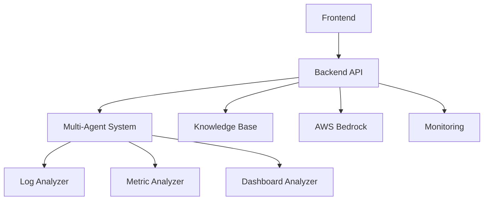
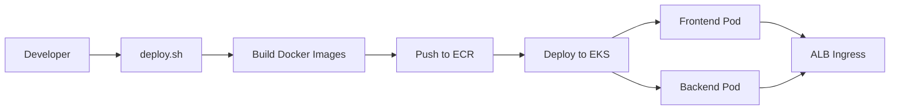
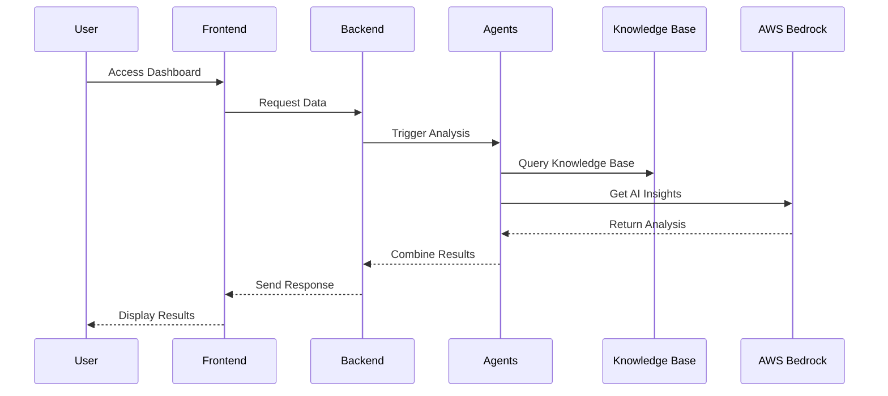
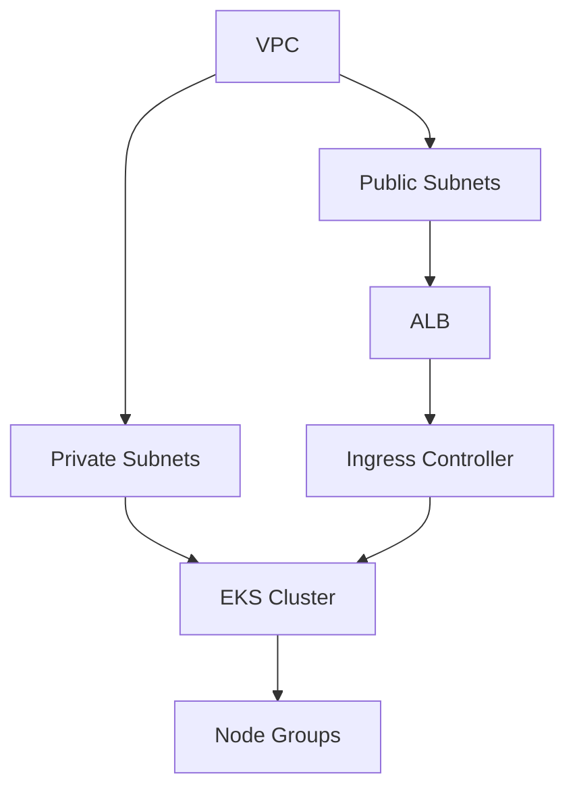
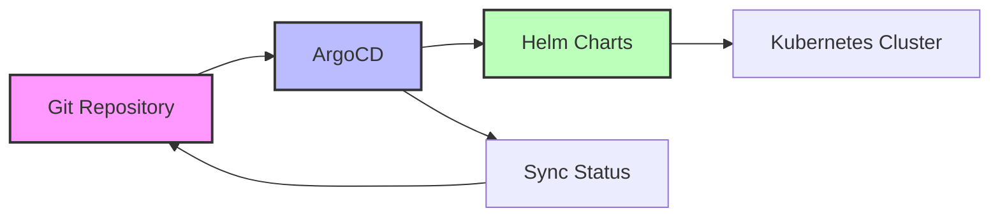
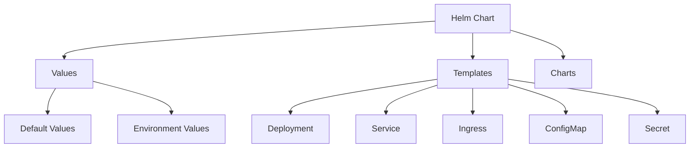
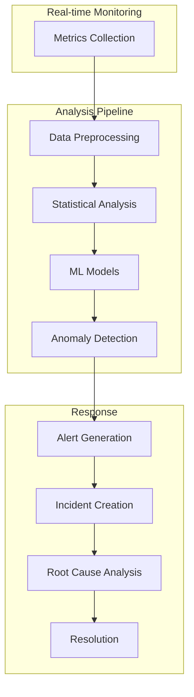

# AIOps Guardian

```
    █████╗ ██╗ ██████╗ ██████╗ ███████╗    ██████╗ ██╗   ██╗ █████╗ ██████╗ ██████╗ ██╗ ██████╗ ███╗   ██╗
   ██╔══██╗██║██╔════╝██╔═══██╗██╔════╝    ██╔══██╗██║   ██║██╔══██╗██╔══██╗██╔══██╗██║██╔═══██╗████╗  ██║
   ███████║██║██║     ██║   ██║███████╗    ██████╔╝██║   ██║███████║██████╔╝██║  ██║██║██║   ██║██╔██╗ ██║
   ██╔══██║██║██║     ██║   ██║╚════██║    ██╔══██╗██║   ██║██╔══██║██╔══██╗██║  ██║██║██║   ██║██║╚██╗██║
   ██║  ██║██║╚██████╗╚██████╔╝███████║    ██║  ██║╚██████╔╝██║  ██║██║  ██║██████╔╝██║╚██████╔╝██║ ╚████║
   ╚═╝  ╚═╝╚═╝ ╚═════╝ ╚═════╝ ╚══════╝    ╚═╝  ╚═╝ ╚═════╝ ╚═╝  ╚═╝╚═╝  ╚═╝╚═════╝ ╚═╝ ╚═════╝ ╚═╝  ╚═══╝
```

```
   ╔════════════════════════════════════════════════════════════════════════════════════════════════════════╗
   ║                                                                                                        ║
   ║  🛡️  Guardian Shield: Protecting your infrastructure with AI-powered insights and automated operations  ║
   ║                                                                                                        ║
   ╚════════════════════════════════════════════════════════════════════════════════════════════════════════╝
```

A comprehensive AIOps platform that leverages AWS Bedrock for intelligent incident management, root cause analysis, and automated operations.

## System Architecture



## Deployment Architecture



## Component Interaction



## Infrastructure Components



## GitOps Workflow with ArgoCD



## Helm Chart Structure



## Anomaly Detection Flow



## Features

- Multi-agent system for incident management
- AWS Bedrock integration for AI-powered insights
- Knowledge base for historical incident data
- Multi-modal analysis of logs, metrics, and dashboards
- Grafana dashboard integration
- Real-time incident response
- Root cause analysis automation
- Anomaly detection and alerting
- Automated incident resolution
- Predictive maintenance

## Project Structure

```
.
├── frontend/           # React.js frontend application
├── backend/           # FastAPI backend service
├── infrastructure/    # Terraform configurations
├── docker/           # Docker configurations
├── agents/           # Multi-agent system
├── knowledge_base/   # Knowledge base and historical data
├── monitoring/       # Monitoring and visualization
├── helm/            # Helm charts
└── argocd/          # ArgoCD configurations
```

## Prerequisites

- Node.js >= 16
- Python >= 3.9
- Docker
- AWS CLI configured
- Terraform >= 1.0
- kubectl

## Setup Instructions

1. Clone the repository
2. Install dependencies:
   ```bash
   # Frontend
   cd frontend
   npm install

   # Backend
   cd backend
   python -m venv venv
   source venv/bin/activate  # or `venv\Scripts\activate` on Windows
   pip install -r requirements.txt
   ```

3. Configure AWS credentials:
   ```bash
   aws configure
   ```

4. Deploy infrastructure:
   ```bash
   cd infrastructure
   terraform init
   terraform plan
   terraform apply
   ```

5. Deploy ArgoCD:
   ```bash
   # Install ArgoCD CLI
   brew install argocd  # macOS
   # or
   curl -sSL -o /usr/local/bin/argocd https://github.com/argoproj/argo-cd/releases/latest/download/argocd-linux-amd64
   chmod +x /usr/local/bin/argocd

   # Install ArgoCD in the cluster
   kubectl create namespace argocd
   kubectl apply -n argocd -f https://raw.githubusercontent.com/argoproj/argo-cd/stable/manifests/install.yaml

   # Wait for ArgoCD to be ready
   kubectl wait --for=condition=ready pod -l app.kubernetes.io/name=argocd-server -n argocd --timeout=300s

   # Get ArgoCD admin password
   argocd admin initial-password -n argocd
   ```

6. Deploy application using ArgoCD:
   ```bash
   # Login to ArgoCD
   argocd login argocd-server

   # Create the application
   kubectl apply -f argocd/applications/sre-copilot.yaml

   # Monitor the deployment
   argocd app get sre-copilot
   ```

7. Manual deployment (alternative):
   ```bash
   # Build and push Docker images
   ./docker/build.sh

   # Deploy using Helm
   helm upgrade --install sre-copilot ./helm/sre-copilot \
     --namespace sre-copilot \
     --create-namespace \
     --set frontend.image.repository=${AWS_ACCOUNT_ID}.dkr.ecr.${AWS_REGION}.amazonaws.com/sre-copilot-frontend \
     --set backend.image.repository=${AWS_ACCOUNT_ID}.dkr.ecr.${AWS_REGION}.amazonaws.com/sre-copilot-backend
   ```

## Development

1. Start frontend development server:
   ```bash
   cd frontend
   npm start
   ```

2. Start backend development server:
   ```bash
   cd backend
   uvicorn main:app --reload
   ```

## License

MIT 