# AIOps Guardian

```
    █████╗ ██╗ ██████╗ ██████╗ ███████╗    ██████╗ ██╗   ██╗ █████╗ ██████╗ ██████╗ ██╗ ██████╗ ███╗   ██╗
   ██╔══██╗██║██╔════╝██╔═══██╗██╔════╝    ██╔══██╗██║   ██║██╔══██╗██╔══██╗██╔══██╗██║██╔═══██╗████╗  ██║
   ███████║██║██║     ██║   ██║███████╗    ██████╔╝██║   ██║███████║██████╔╝██║  ██║██║██║   ██║██╔██╗ ██║
   ██╔══██║██║██║     ██║   ██║╚════██║    ██╔══██╗██║   ██║██╔══██║██╔══██╗██║  ██║██║██║   ██║██║╚██╗██║
   ██║  ██║██║╚██████╗╚██████╔╝███████║    ██║  ██║╚██████╔╝██║  ██║██║  ██║██████╔╝██║╚██████╔╝██║ ╚████║
   ╚═╝  ╚═╝╚═╝ ╚═════╝ ╚═════╝ ╚══════╝    ╚═╝  ╚═╝ ╚═════╝ ╚═╝  ╚═╝╚═╝  ╚═╝╚═════╝ ╚═╝ ╚═════╝ ╚═╝  ╚═══╝
```

```
   ╔════════════════════════════════════════════════════════════════════════════════════════════════════════╗
   ║                                                                                                        ║
   ║  🛡️  Guardian Shield: Protecting your infrastructure with AI-powered insights and automated operations  ║
   ║                                                                                                        ║
   ╚════════════════════════════════════════════════════════════════════════════════════════════════════════╝
```

A comprehensive AIOps platform that leverages AWS Bedrock for intelligent incident management, root cause analysis, and automated operations.

## Table of Contents

1. [System Architecture](#system-architecture)
2. [Deployment Architecture](#deployment-architecture)
3. [Component Interaction](#component-interaction)
4. [Infrastructure Components](#infrastructure-components)
5. [GitOps Workflow](#gitops-workflow-with-argocd)
6. [Helm Chart Structure](#helm-chart-structure)
7. [Anomaly Detection](#anomaly-detection-flow)
8. [Step Functions Workflow](#step-functions-workflow)
9. [AWS Step Functions Integration](#aws-step-functions-integration)
10. [CloudWatch Metrics](#cloudwatch-metrics-and-alarms)
11. [EventBridge Rules](#eventbridge-rules-and-patterns)
12. [Lambda Functions](#lambda-function-interactions)
13. [Monitoring Flow](#monitoring-and-alerting-flow)
14. [Auto-Remediation](#auto-remediation-with-ansible-and-aws-ssm)
15. [Features](#features)
16. [Vector Search](#vector-search-for-incident-similarity)
17. [Project Structure](#project-structure)
18. [Prerequisites](#prerequisites)
19. [Setup Instructions](#setup-instructions)
20. [Development](#development)
21. [License](#license)

## System Architecture

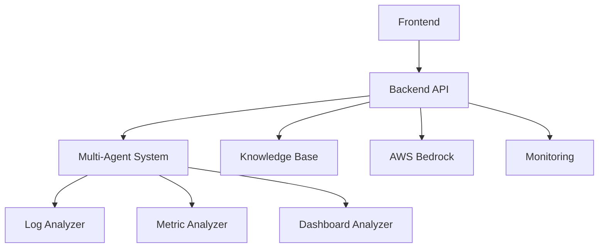

## Deployment Architecture

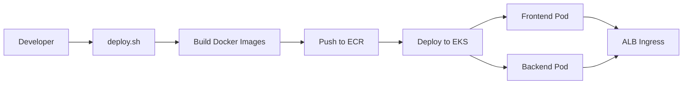

## Component Interaction

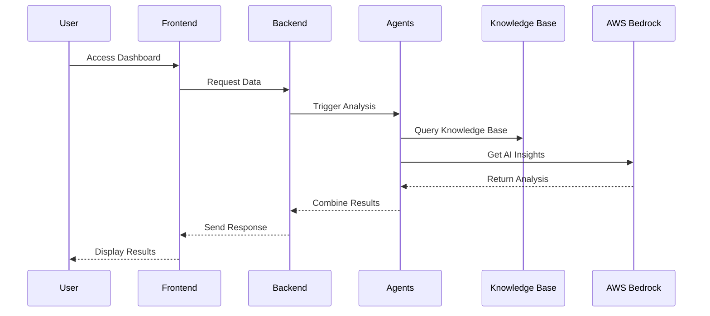

## Infrastructure Components

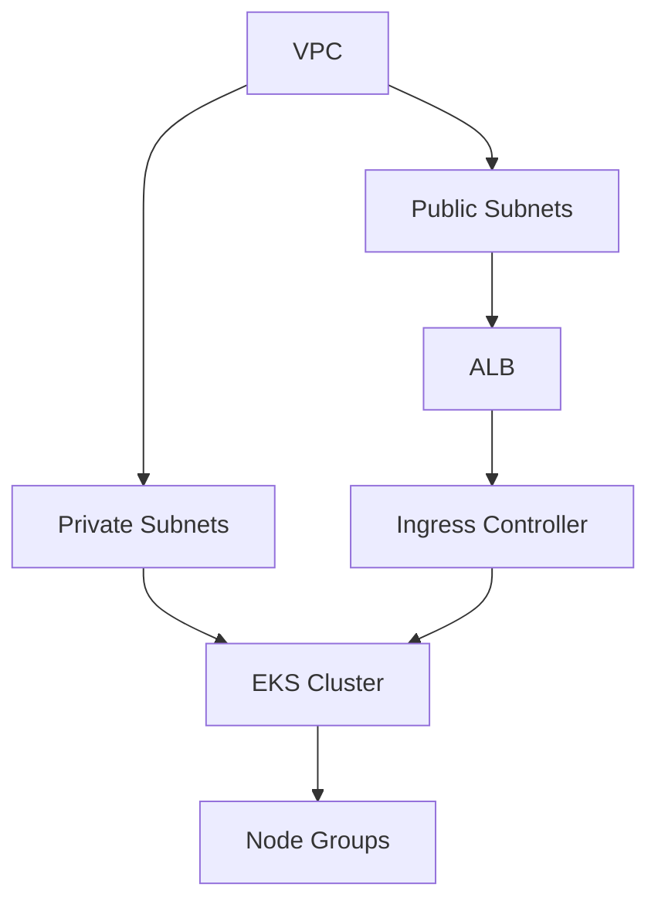

## GitOps Workflow with ArgoCD

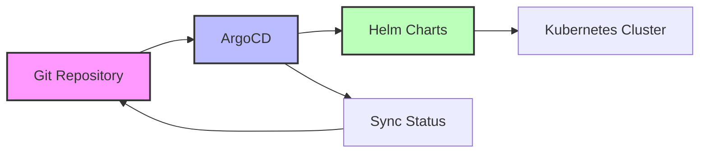

## Helm Chart Structure

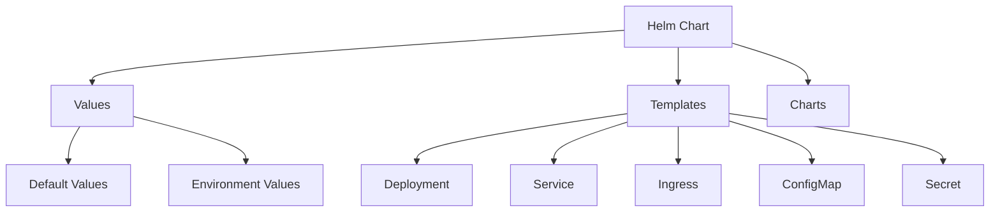

## Anomaly Detection Flow

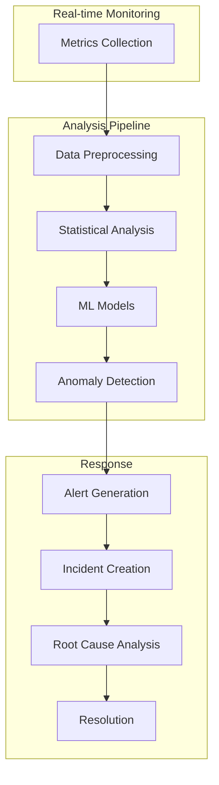

## Step Functions Workflow

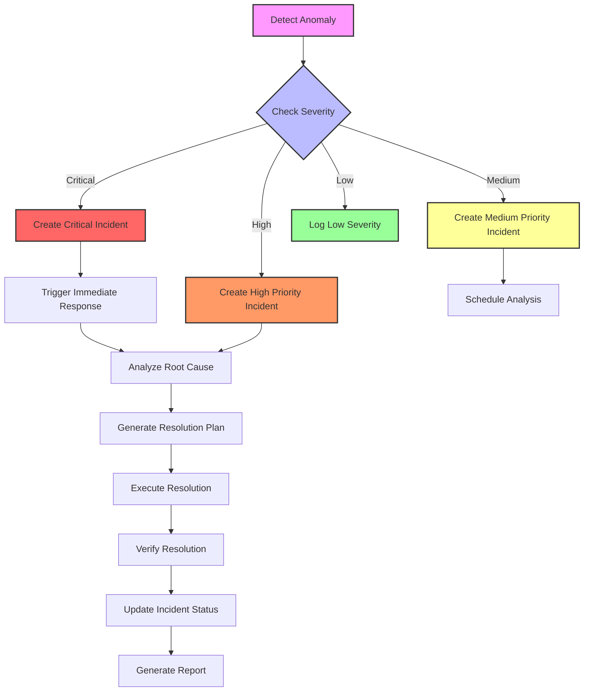

## AWS Step Functions Integration

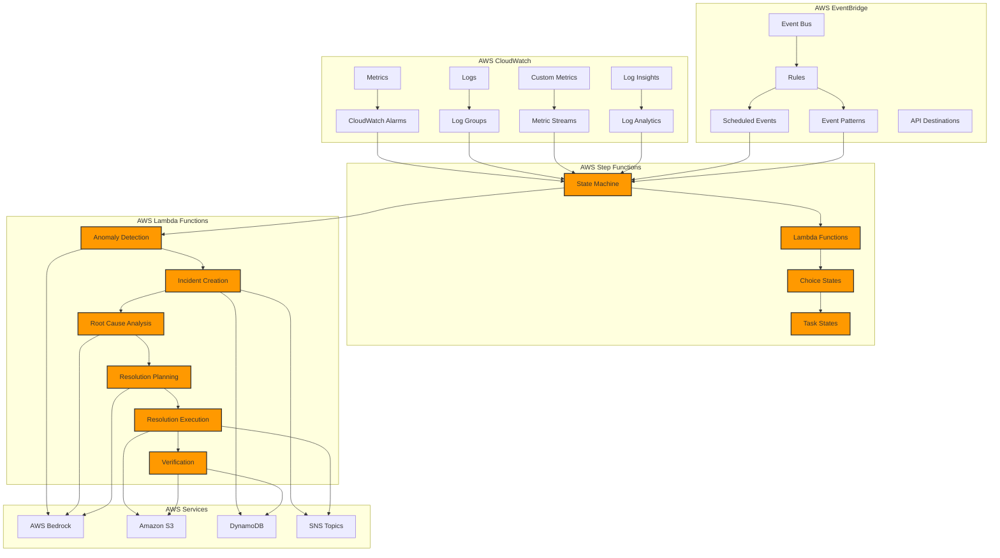

## CloudWatch Metrics and Alarms

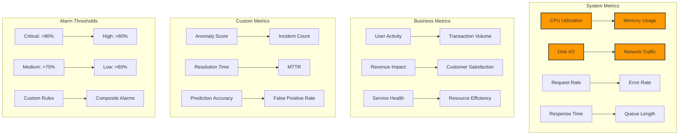

## EventBridge Rules and Patterns

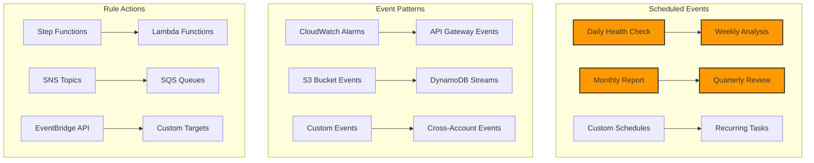

## Lambda Function Interactions

```mermaid
graph TD
    subgraph "Anomaly Detection"
        A[Collect Metrics] --> B[Preprocess Data]
        B --> C[Apply ML Models]
        C --> D[Calculate Scores]
        D --> E[Generate Alerts]
    end

    subgraph "Incident Management"
        F[Create Incident] --> G[Assign Priority]
        G --> H[Notify Teams]
        H --> I[Track Status]
        I --> J[Update Records]
    end

    subgraph "Resolution Process"
        K[Analyze Root Cause] --> L[Generate Plan]
        L --> M[Execute Actions]
        M --> N[Verify Results]
        N --> O[Document Learnings]
    end

    style A fill:#ff9900,stroke:#333,stroke-width:2px
    style B fill:#ff9900,stroke:#333,stroke-width:2px
    style C fill:#ff9900,stroke:#333,stroke-width:2px
    style D fill:#ff9900,stroke:#333,stroke-width:2px
```

## Monitoring and Alerting Flow

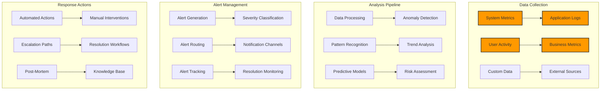

## Auto-Remediation with Ansible and AWS SSM

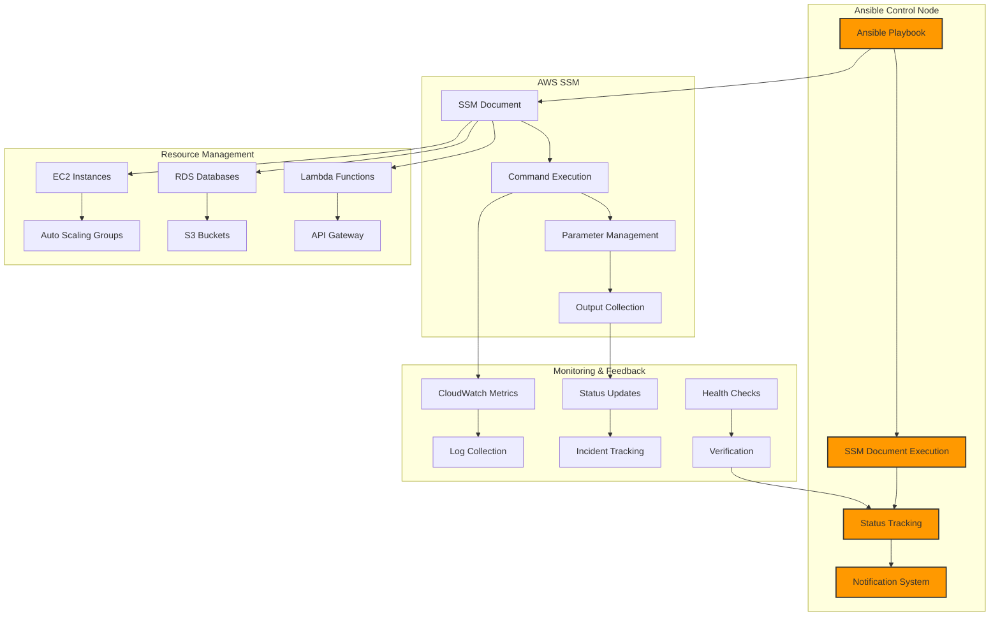

### Ansible Integration Features

- **Playbook Management**:
  - Dynamic inventory management
  - Role-based execution
  - Variable templating
  - Conditional execution
  - Error handling and retries

- **SSM Document Integration**:
  - Document versioning
  - Parameter validation
  - Output collection
  - Status tracking
  - Error handling

- **Resource Management**:
  - Multi-resource support
  - State management
  - Dependency handling
  - Rollback capabilities
  - Health verification

### Ansible Playbook Structure

```yaml
# Example playbook structure
---
- name: Auto-Remediation Playbook
  hosts: localhost
  gather_facts: false
  vars:
    aws_region: "{{ aws_region | default('us-west-2') }}"
    incident_id: "{{ incident_id }}"
    severity: "{{ severity }}"
    resource_id: "{{ resource_id }}"
    resource_type: "{{ resource_type }}"
    remediation_action: "{{ remediation_action }}"
    ssm_document_name: "{{ ssm_document_name | default('AIOpsGuardian-Remediation') }}"

  tasks:
    - name: Get AWS SSM Document
      amazon.aws.ssm_document_info:
        name: "{{ ssm_document_name }}"
        region: "{{ aws_region }}"
      register: ssm_doc

    - name: Execute SSM Document
      amazon.aws.ssm_document_execution:
        document_name: "{{ ssm_document_name }}"
        parameters:
          IncidentId: "{{ incident_id }}"
          Severity: "{{ severity }}"
          ResourceId: "{{ resource_id }}"
          ResourceType: "{{ resource_type }}"
          RemediationAction: "{{ remediation_action }}"
        region: "{{ aws_region }}"
      register: execution_result
      when: ssm_doc.documents is defined and ssm_doc.documents | length > 0

    - name: Update Incident Status
      amazon.aws.dynamodb_table:
        name: "AIOpsGuardian-Incidents"
        region: "{{ aws_region }}"
        operation: update_item
        key:
          IncidentId: "{{ incident_id }}"
        attributes:
          RemediationStatus: "{{ 'COMPLETED' if execution_result.status == 'SUCCESS' else 'FAILED' }}"
          RemediationResult: "{{ execution_result.output }}"
          LastUpdated: "{{ ansible_date_time.iso8601 }}"
      when: execution_result is defined

    - name: Send SNS Notification
      amazon.aws.sns_topic:
        region: "{{ aws_region }}"
        topic_arn: "arn:aws:sns:{{ aws_region }}:{{ aws_account_id }}:AIOpsGuardian-Remediation"
        message: |
          Remediation executed for incident {{ incident_id }}
          Status: {{ execution_result.status if execution_result is defined else 'FAILED' }}
          Resource: {{ resource_id }}
          Action: {{ remediation_action }}
        subject: "AIOps Guardian - Remediation {{ execution_result.status if execution_result is defined else 'FAILED' }}"
      when: execution_result is defined

    - name: Log Remediation Result
      amazon.aws.cloudwatch_log:
        region: "{{ aws_region }}"
        log_group: "/aws/aiops-guardian/remediation"
        log_stream: "{{ incident_id }}"
        message: |
          {
            "timestamp": "{{ ansible_date_time.iso8601 }}",
            "incident_id": "{{ incident_id }}",
            "resource_id": "{{ resource_id }}",
            "remediation_action": "{{ remediation_action }}",
            "status": "{{ execution_result.status if execution_result is defined else 'FAILED' }}",
            "result": "{{ execution_result.output if execution_result is defined else 'No execution result' }}"
          }
      when: execution_result is defined
```

### Setup and Configuration

1. **Install Ansible and AWS Collections**:
   ```bash
   # Install Ansible
   pip install ansible

   # Install required collections
   ansible-galaxy collection install -r ansible/requirements.yml
   ```

2. **Configure AWS Credentials**:
   ```bash
   # Configure AWS CLI
   aws configure

   # Or set environment variables
   export AWS_ACCESS_KEY_ID="your_access_key"
   export AWS_SECRET_ACCESS_KEY="your_secret_key"
   export AWS_DEFAULT_REGION="us-west-2"
   ```

3. **Create SSM Document**:
   ```bash
   # Create the SSM document
   aws ssm create-document \
     --content file://ansible/ssm_documents/remediation_document.json \
     --name "AIOpsGuardian-Remediation" \
     --document-type "Command" \
     --document-format "JSON"
   ```

4. **Run Remediation Playbook**:
   ```bash
   # Basic execution
   ansible-playbook ansible/playbooks/auto_remediation.yml \
     -e "incident_id=INC-123" \
     -e "severity=HIGH" \
     -e "resource_id=i-1234567890abcdef0" \
     -e "resource_type=EC2" \
     -e "remediation_action=RESTART"

   # With additional variables
   ansible-playbook ansible/playbooks/auto_remediation.yml \
     -e "incident_id=INC-123" \
     -e "severity=HIGH" \
     -e "resource_id=i-1234567890abcdef0" \
     -e "resource_type=EC2" \
     -e "remediation_action=RESTART" \
     -e "aws_region=us-west-2" \
     -e "ssm_document_name=AIOpsGuardian-Remediation-v2"
   ```

### Best Practices

1. **Playbook Organization**:
   - Use roles for modularity
   - Implement proper error handling
   - Include documentation
   - Use variables for flexibility

2. **SSM Document Management**:
   - Version control documents
   - Implement parameter validation
   - Include proper error handling
   - Document all actions

3. **Security Considerations**:
   - Use IAM roles
   - Implement least privilege
   - Secure sensitive data
   - Audit all actions

4. **Monitoring and Logging**:
   - Track all executions
   - Monitor performance
   - Log all actions
   - Implement alerts

## Features

- Multi-agent system for incident management
- AWS Bedrock integration for AI-powered insights
- Knowledge base for historical incident data
- Multi-modal analysis of logs, metrics, and dashboards
- Grafana dashboard integration
- Real-time incident response
- Root cause analysis automation
- Anomaly detection and alerting
- Automated incident resolution
- Predictive maintenance

## Vector Search for Incident Similarity

The AIOps Guardian system implements advanced vector search capabilities using both traditional embeddings and BERT-based embeddings for incident similarity search. This dual-embedding approach provides enhanced semantic understanding and improved search accuracy.

> **Integration Points**:
> - Works with [Anomaly Detection](#anomaly-detection-flow) for incident pattern matching
> - Integrates with [Knowledge Base](#component-interaction) for historical data
> - Supports [Auto-Remediation](#auto-remediation-with-ansible-and-aws-ssm) through similar incident resolution
> - Provides metrics for [CloudWatch Monitoring](#cloudwatch-metrics-and-alarms)

### Architecture

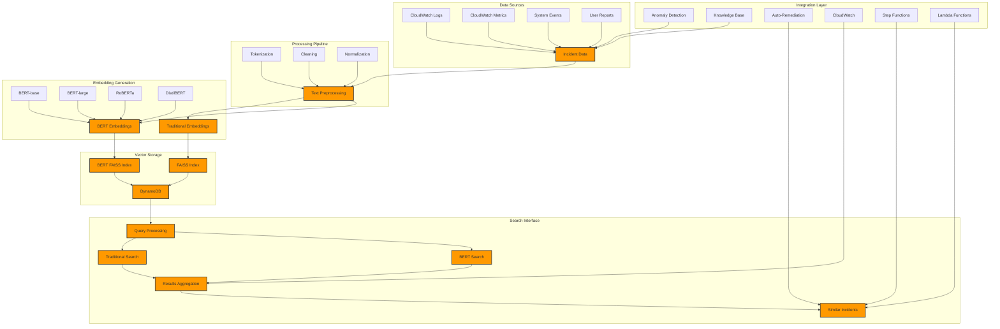

### Integration Examples

1. **Anomaly Detection Integration**
```python
# Search for similar historical anomalies
POST /api/v1/vector-search/search
{
    "query": "CPU utilization spike in production",
    "k": 5,
    "use_bert": true,
    "model_type": "BERT_LARGE",
    "filter": {
        "type": "ANOMALY",
        "severity": "HIGH",
        "time_range": "LAST_30_DAYS"
    },
    "include_metrics": true,
    "include_logs": true
}
```

2. **Knowledge Base Integration**
```python
# Search knowledge base for similar incidents
POST /api/v1/vector-search/search
{
    "query": "database connection pool exhaustion",
    "k": 5,
    "use_bert": true,
    "model_type": "ROBERTA",
    "source": "KNOWLEDGE_BASE",
    "include_solutions": true,
    "include_playbooks": true
}
```

3. **Auto-Remediation Integration**
```python
# Find similar resolved incidents for auto-remediation
POST /api/v1/vector-search/search
{
    "query": "high memory usage in production database",
    "k": 5,
    "use_bert": true,
    "model_type": "BERT_LARGE",
    "filter": {
        "status": "RESOLVED",
        "severity": "HIGH",
        "has_remediation": true
    },
    "include_remediation_steps": true,
    "include_verification": true
}
```

4. **Step Functions Integration**
```python
# Search for similar incidents in workflow
POST /api/v1/vector-search/search
{
    "query": "service degradation in user-facing API",
    "k": 5,
    "use_bert": true,
    "model_type": "BERT_LARGE",
    "workflow_id": "INC-123",
    "include_workflow_state": true,
    "include_actions_taken": true
}
```

5. **Lambda Function Integration**
```python
# Search for similar incidents in Lambda context
POST /api/v1/vector-search/search
{
    "query": "error rate spike in payment service",
    "k": 5,
    "use_bert": true,
    "model_type": "BERT_LARGE",
    "lambda_context": {
        "function_name": "payment-processor",
        "error_type": "TimeoutException",
        "region": "us-west-2"
    },
    "include_error_patterns": true,
    "include_stack_traces": true
}
```

6. **CloudWatch Integration**
```python
# Search incidents with metric correlation
POST /api/v1/vector-search/search
{
    "query": "high latency in API endpoints",
    "k": 5,
    "use_bert": true,
    "model_type": "BERT_LARGE",
    "metrics": {
        "latency": ">500ms",
        "error_rate": ">1%",
        "time_range": "LAST_HOUR"
    },
    "include_metric_graphs": true,
    "include_log_insights": true
}
```

## Project Structure

```
.
├── frontend/           # React.js frontend application
├── backend/           # FastAPI backend service
├── infrastructure/    # Terraform configurations
├── docker/           # Docker configurations
├── agents/           # Multi-agent system
├── knowledge_base/   # Knowledge base and historical data
├── monitoring/       # Monitoring and visualization
├── helm/            # Helm charts
└── argocd/          # ArgoCD configurations
```

## Prerequisites

- Node.js >= 16
- Python >= 3.9
- Docker
- AWS CLI configured
- Terraform >= 1.0
- kubectl

## Setup Instructions

1. Clone the repository
2. Install dependencies:
   ```bash
   # Frontend
   cd frontend
   npm install

   # Backend
   cd backend
   python -m venv venv
   source venv/bin/activate  # or `venv\Scripts\activate` on Windows
   pip install -r requirements.txt
   ```

3. Configure AWS credentials:
   ```bash
   aws configure
   ```

4. Deploy infrastructure:
   ```bash
   cd infrastructure
   terraform init
   terraform plan
   terraform apply
   ```

5. Deploy ArgoCD:
   ```bash
   # Install ArgoCD CLI
   brew install argocd  # macOS
   # or
   curl -sSL -o /usr/local/bin/argocd https://github.com/argoproj/argo-cd/releases/latest/download/argocd-linux-amd64
   chmod +x /usr/local/bin/argocd

   # Install ArgoCD in the cluster
   kubectl create namespace argocd
   kubectl apply -n argocd -f https://raw.githubusercontent.com/argoproj/argo-cd/stable/manifests/install.yaml

   # Wait for ArgoCD to be ready
   kubectl wait --for=condition=ready pod -l app.kubernetes.io/name=argocd-server -n argocd --timeout=300s

   # Get ArgoCD admin password
   argocd admin initial-password -n argocd
   ```

6. Deploy application using ArgoCD:
   ```bash
   # Login to ArgoCD
   argocd login argocd-server

   # Create the application
   kubectl apply -f argocd/applications/sre-copilot.yaml

   # Monitor the deployment
   argocd app get sre-copilot
   ```

7. Manual deployment (alternative):
   ```bash
   # Build and push Docker images
   ./docker/build.sh

   # Deploy using Helm
   helm upgrade --install sre-copilot ./helm/sre-copilot \
     --namespace sre-copilot \
     --create-namespace \
     --set frontend.image.repository=${AWS_ACCOUNT_ID}.dkr.ecr.${AWS_REGION}.amazonaws.com/sre-copilot-frontend \
     --set backend.image.repository=${AWS_ACCOUNT_ID}.dkr.ecr.${AWS_REGION}.amazonaws.com/sre-copilot-backend
   ```

## Development

1. Start frontend development server:
   ```bash
   cd frontend
   npm start
   ```

2. Start backend development server:
   ```bash
   cd backend
   uvicorn main:app --reload
   ```

## License

MIT 
